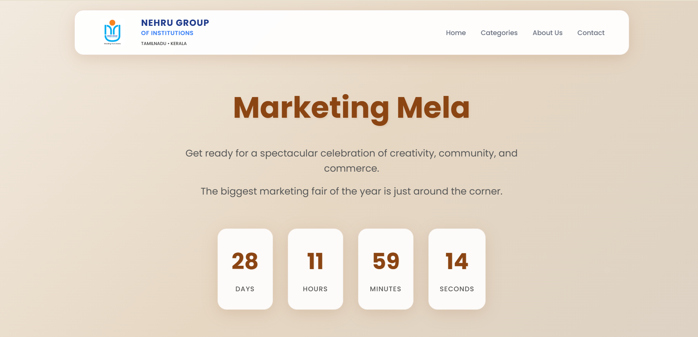

# 📢 Marketing Mela 2025  

  
  
  
  
  

Marketing Mela is a **web-based event showcase platform** for Nehru Group of Institutions.  
It highlights stalls, products, and categories in an interactive and visually engaging way, complete with a **countdown timer**, **dynamic stalls display**, and **responsive design**.  

---

## 🚀 Features  

- 📅 **Countdown Timer** – Tracks time until the event (September 15, 2025).  
- 🏪 **Dynamic Stalls & Products** – Stalls and products load dynamically via JavaScript.  
- 🎨 **Responsive & Modern UI** – Built with custom CSS for desktop and mobile.  
- 📂 **Categories** – Filter stalls by Clothes, Food, Accessories, Handicrafts, and Games.  
- 🔍 **Modal View** – Click on a stall to explore its products.  
- 📱 **Mobile-Friendly Navigation** – Hamburger menu with smooth scroll support.  
- 🛡️ **Accessibility Ready** – ARIA roles, focus styles, and keyboard navigation.  

---

## 🖥️ Tech Stack  

- **Frontend**: HTML5, CSS3, JavaScript (Vanilla JS)  
- **Styling**: Custom CSS with animations, transitions, and responsive design  
- **Icons**: Font Awesome  
- **Fonts**: Google Fonts (Poppins)  

---

## 📸 Preview  

  
*(Add a screenshot of your webpage and name it `preview.png` in the repo for this to work)*  

---

## 📂 Project Structure  

```
marketing-mela/
│── index.html       # Main HTML file
│── styles.css       # Styling and responsive design
│── script.js        # Logic for countdown, stalls, and modal
│── LOGO.png         # Institute logo
│── preview.png      # (Optional) Screenshot for README
```

---

## 📝 Future Improvements  

- 🔑 User authentication & student login  
- 💳 Online payment system (UPI/Wallets for Indian users)  
- 🛠️ Admin panel to manage stalls, products, and payments  
- 🔥 Firebase integration for real-time sync  

---

## 📞 Contact  

📧 Email: info@marketingmela.com  
📍 Location: Nehru Group Campus, Coimbatore, Tamil Nadu  

---

📌 *Developed as part of the Marketing Mela 2025 event showcase project.*  
